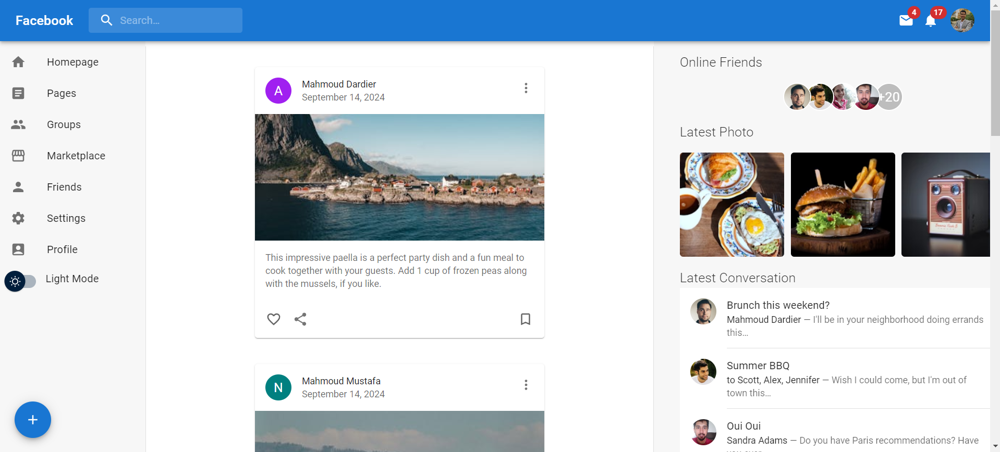
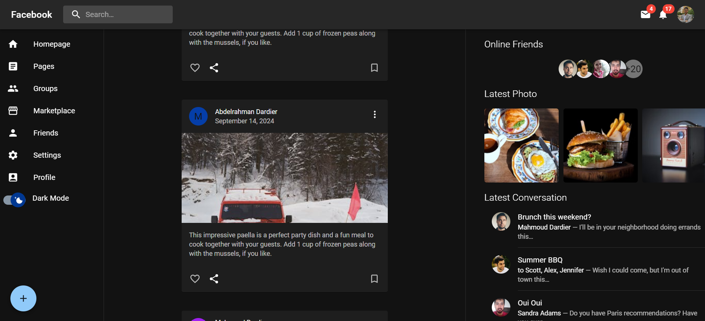
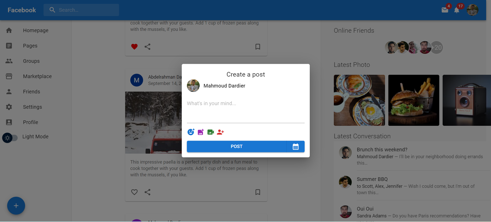

# Mini Facebook React App 

This is a fully responsive social media web application built using React.js and material UI. The app is look a lot like user interface of facebook app. the greatest focus in designing this app was training on using material Ui 

## 🌟 [Live Website](https://social-mediaa-react-app.netlify.app/) 🌟

## Screenshot

### Light Mode


### Dark Mode


### Add Post


## Installation

1. Clone the repository:
   ```bash
   git clone https://github.com/Mmostafa1999/Mini-Facebook.git

2. Install dependencies:
   ```bash
   npm install

3. Run the development server:
   ```bash
   npm start

Feel free to contribute or report issues!

## Technologies Used
1. **React:** The project is structured as a React application, utilizing functional components, hooks like useState and useRef, and JSX syntax for building the UI.
2. **Material-UI (MUI):** The project makes extensive use of Material-UI components like `AppBar`, `Toolbar`, `IconButton`, `Menu`, `Typography`, and more. Custom styles are applied using MUI's styled and theme capabilities.
3. **Icons from MUI:** Icons are imported from the @mui/icons-material package, providing a wide range of material design icons.
4. **JavaScript ES6+:** The code utilizes modern JavaScript features like arrow functions, destructuring, template literals, and more.
   
## Contact
- [Author](https://github.com/Mmostafa1999)
- [Website](https://todo-list-jet-five-39.vercel.app/)
- [Email](mahmoud.mostafa4467@gmail.com)
- [Linkedin](https://www.linkedin.com/in/mahmoud-mustafa-642434188/)
